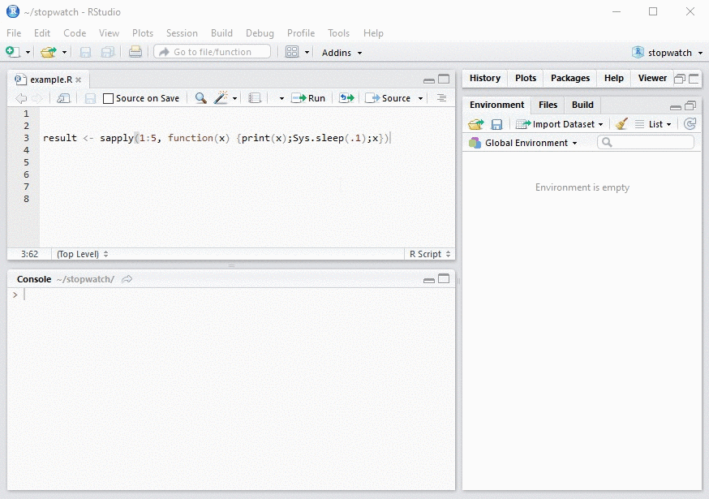

## Stopwatch

Stopwatch is a light-weight RStudio add-in to facilitate timing chunks of code. 

## Installation

Install the package from Github:

```R
# install.packages("devtools")
devtools::install_github("jenswirf/stopwatch")
```

## Usage

The usual pattern of wrapping code in `system.time` is arguably clunky:

```R
system.time({
  result <- sapply(1:5, function(x) {print(x); Sys.sleep(.1); x})
})
```

Stopwatch allows you to simply time a selected chunk of code:


### Tidy timings
The returned result of `system.time` is a named vector - which requires a little bit of work to extract the information. Stopwatch saves the output to a tibble (`.timings`) for easy access:
```{r, message=FALSE, warning=FALSE, include=FALSE}
.timings <- structure(list(index = c(1, 2, 3, 4, 5), start = structure(c(1485436369.70065, 
1485436377.11259, 1485436386.70319, 1485436392.94358, 1485436400.22947
), class = c("POSIXct", "POSIXt"), tzone = ""), user = c(0, 0, 
0, 0, 0), system = c(0, 0, 0.02, 0, 0), elapsed = c(0.5, 0.6099999999999, 
0.710000000000036, 0.610000000000127, 0.540000000000191), call = c("sapply(1:5, function(x) { print(x) Sys.sleep(0....", 
"sapply(1:6, function(x) { print(x) Sys.sleep(0....", "sapply(1:7, function(x) { print(x) Sys.sleep(0....", 
"sapply(1:6, function(x) { print(x) Sys.sleep(0....", "sapply(1:5, function(x) { print(x) Sys.sleep(0...."
)), .Names = c("index", "start", "user", "system", "elapsed", 
"call"), row.names = c(NA, -5L), class = c("tbl_df", "tbl", "data.frame"
))
```


```{r}
.timings
```


```{r tidy}
ggplot(.timings, aes(index, elapsed)) + geom_col()
```


