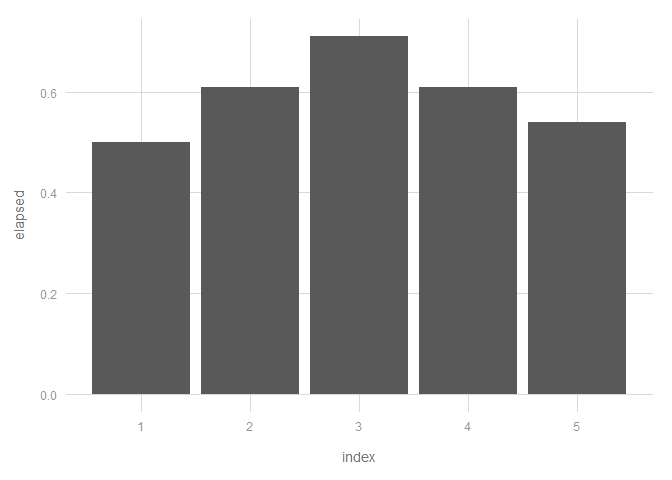

Stopwatch
---------

Stopwatch is a light-weight RStudio add-in to facilitate timing chunks of code.

Installation
------------

Install the package from Github:

``` r
# install.packages("devtools")
devtools::install_github("jenswirf/stopwatch")
```

Usage
-----

The usual pattern of wrapping code in `system.time` is arguably clunky:

``` r
system.time({
  result <- sapply(1:5, function(x) {print(x); Sys.sleep(.1); x})
})
```

Stopwatch allows you to simply time a selected chunk of code: 

### Tidy timings

The returned result of `system.time` is a named vector - which requires a little bit of work to extract the information. Stopwatch saves the output to a tibble (`.timings`) for easy access:

``` r
.timings
```

    ## # A tibble: 5 × 6
    ##   index               start  user system elapsed
    ##   <dbl>              <dttm> <dbl>  <dbl>   <dbl>
    ## 1     1 2017-01-26 14:12:49     0   0.00    0.50
    ## 2     2 2017-01-26 14:12:57     0   0.00    0.61
    ## 3     3 2017-01-26 14:13:06     0   0.02    0.71
    ## 4     4 2017-01-26 14:13:12     0   0.00    0.61
    ## 5     5 2017-01-26 14:13:20     0   0.00    0.54
    ## # ... with 1 more variables: call <chr>

``` r
ggplot(.timings, aes(index, elapsed)) + geom_col()
```


